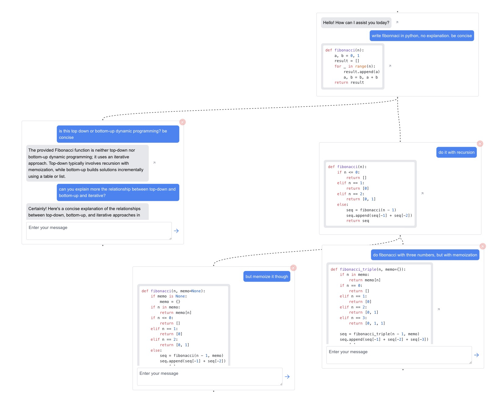

# chat-tree

The problem with current chat interfaces is that they restrict the conversation to only a single thread.

[chat-tree](https://chat-tree-inky.vercel.app) is a tool that allows you to ask multiple independent follow-up questions without polluting the context or scrolling up and down through the chat history.

<p align="center">
  
</p>


## Getting Started

Run the development server:

```bash
npm run dev
# or
yarn dev
# or
pnpm dev
# or
bun dev
```

Open [http://localhost:3000](http://localhost:3000) with your browser to see the result.